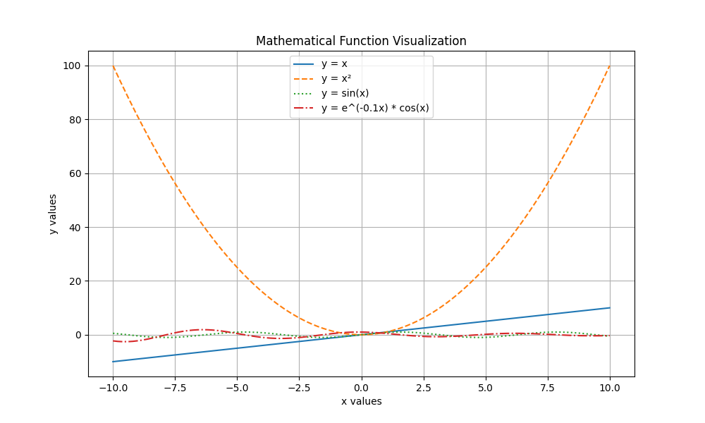
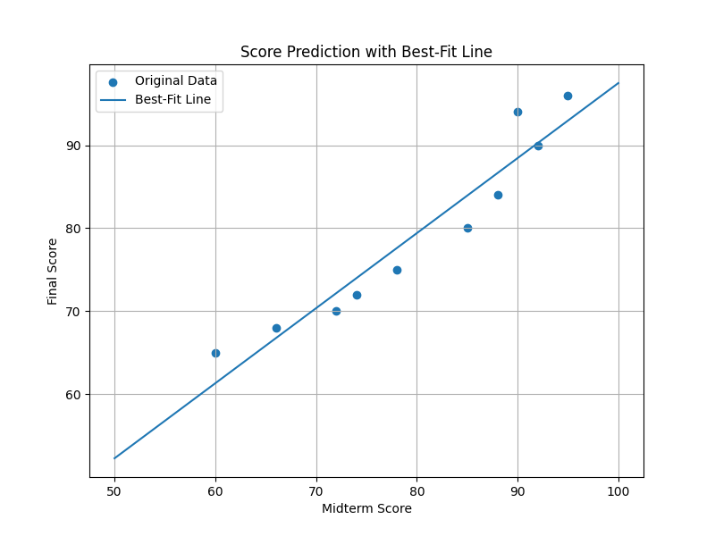

# Math Visualization Assignment

## 1. Project Title

Math Visualization Assignment

---

## 2. Short Project Description

This project is a Python-based mathematical visualization assignment using NumPy and Matplotlib.

The purpose of this project is to visualize mathematical functions and student score data using different graph types such as:

- line plots
- scatter plots
- histograms
- bar charts
- prediction graphs

The project also demonstrates the use of a best-fit line for simple prediction analysis.

---

## 3. Libraries Used

The following Python libraries were used in this project:

- NumPy
- Matplotlib

Install the required libraries using:

```bash
pip install numpy matplotlib
```

---

## 4. How to Run the Code

Run the Python file using:

```bash
python math_visualization.py
```

Or run the notebook file:

```bash
math_visualization.ipynb
```

---

## 5. Screenshots of Generated Graphs

### Function Visualization



### Prediction Graph



---

## 6. Short Explanation

### How does visualization help us understand mathematical functions and data?

Visualization helps people understand mathematical patterns, trends, and relationships more clearly.

Instead of only reading equations or numerical values, graphs allow us to visually analyze how functions behave and how data changes.

Visualization also makes complex information easier to interpret.

---

### Which plot was most useful in this assignment and why?

The most useful plot in this assignment was the best-fit prediction graph.

This graph clearly showed the relationship between midterm and final scores and helped visualize prediction using a linear regression line.

It was useful because it combined both data analysis and visualization together.

---

### What is the role of NumPy and Matplotlib in your project?

NumPy was used for:
- mathematical calculations
- creating arrays
- generating function values
- performing numerical operations

Matplotlib was used for:
- plotting graphs
- visualizing data
- creating charts
- customizing figures with titles, labels, legends, and grids

---

## Output Files

The following files are generated after running the code:

```text
function_plot.png
own_equation.png
score_scatter.png
score_histogram.png
score_bar_chart.png
score_prediction.png
```

---

## Project Structure

```text
math-visualization-assignment/
│
├── math_visualization.py
├── function_plot.png
├── own_equation.png
├── score_scatter.png
├── score_histogram.png
├── score_bar_chart.png
├── score_prediction.png
└── README.md
```

---

## Conclusion

Through this assignment, I learned:
- mathematical visualization
- graph plotting in Python
- data analysis techniques
- the use of NumPy and Matplotlib
- organizing an open-source style GitHub project

This project improved my understanding of how visualization can make mathematical concepts and data easier to understand.
